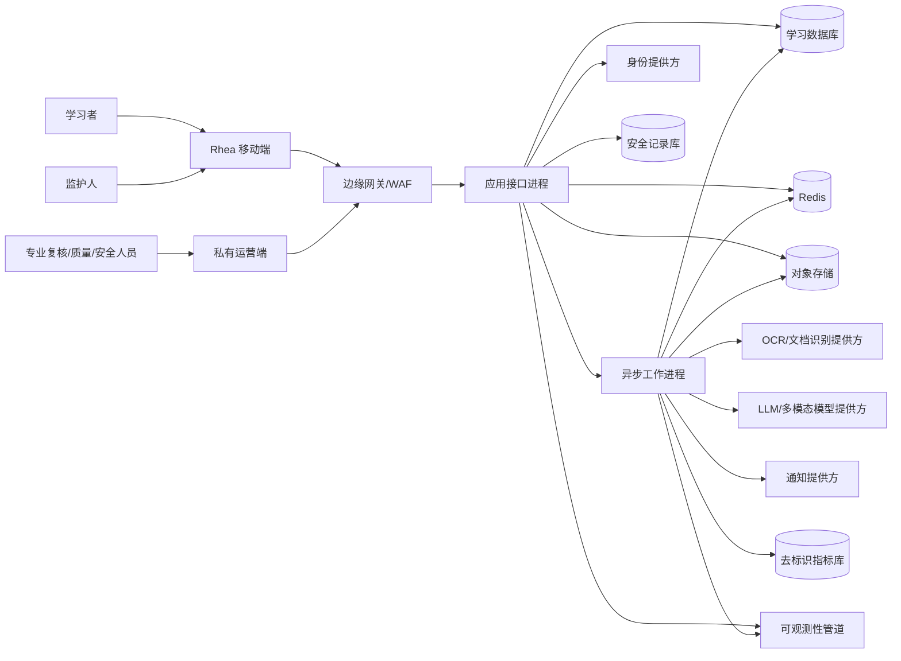
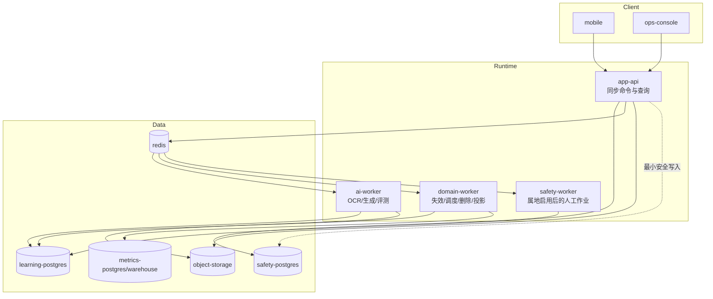
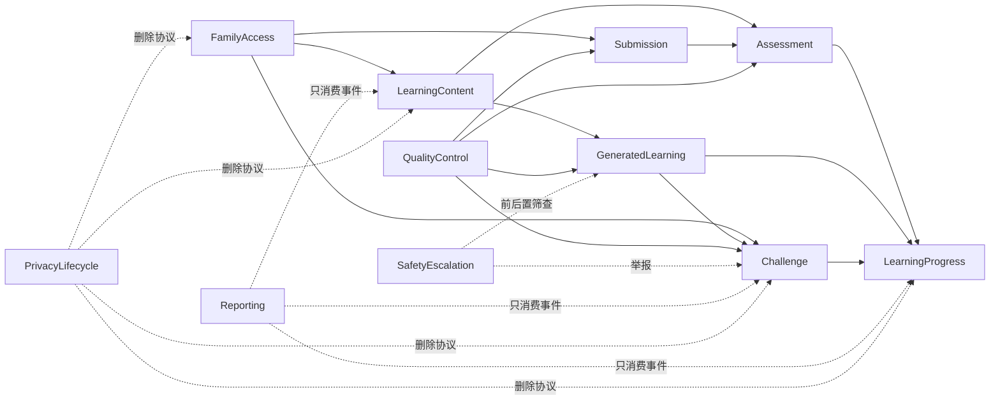
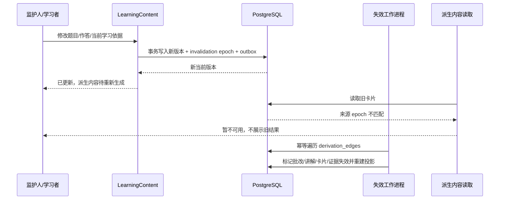
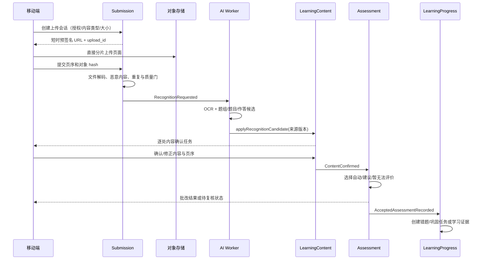
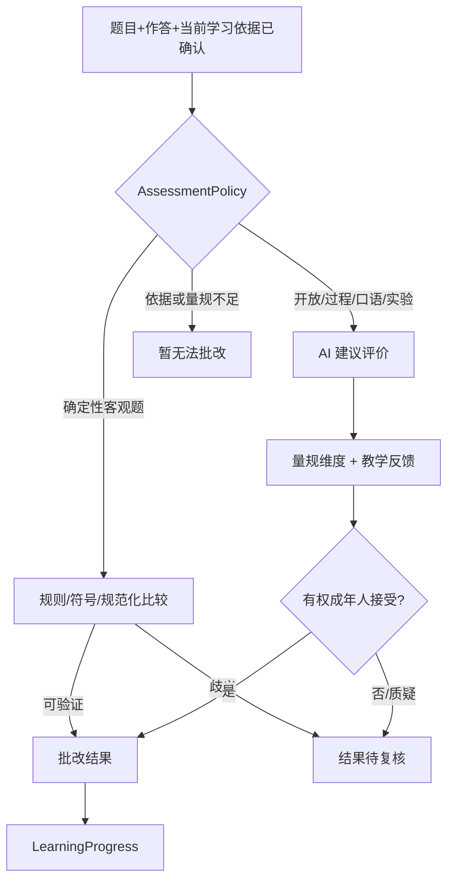
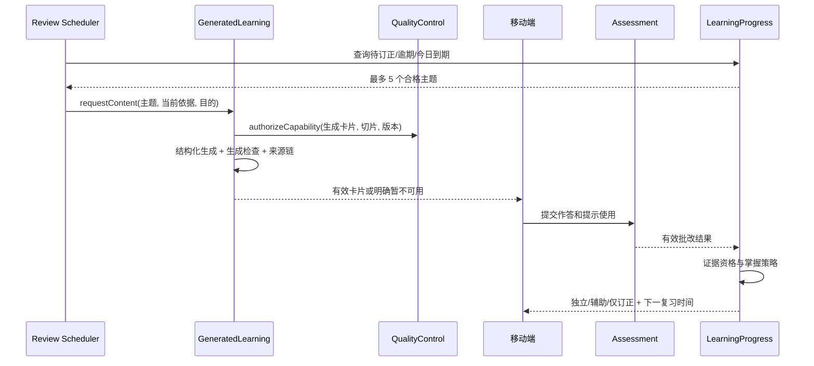
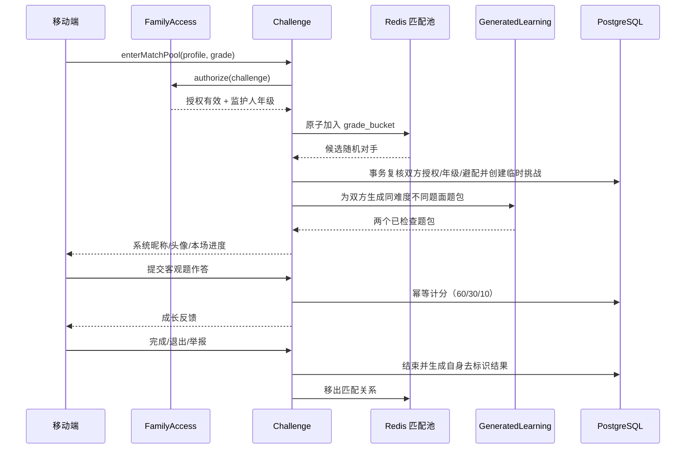
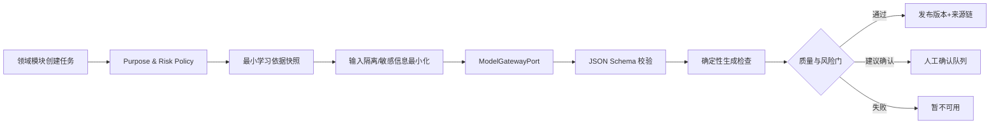
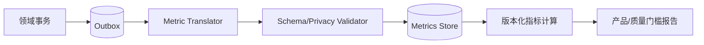

# Rhea 小学生 AI 学习助手技术架构方案 V1

| 项目 | 内容 |
| --- | --- |
| 文档状态 | 推荐技术基线，可进入工程拆解与 ADR 签署 |
| 版本 | V1.0 |
| 日期 | 2026-09-08 |
| 产品基线 | [《Rhea 小学生 AI 学习助手产品需求方案 V1》](../requirements/rhea-ai-learning-assistant-prd-v1.md) |
| 适用阶段 | 邀请制家庭试用至 MVP 学习成功验证 |

> 本方案给出可实现的推荐架构。涉及公开上线地区、法定留存、监护人验证强度、求助资源和人工值守的配置，仍须由每个服务地区的安全与合规属地包决定。

## 1. 架构结论

Rhea V1 采用 **TypeScript 模块化单体 + 独立异步工作进程 + PostgreSQL 权威数据源**。移动端使用 React Native/Expo；AI、OCR、对象存储、身份提供方和通知提供方全部位于可替换的适配器 seam 后面。

核心原则是：

1. **确定性代码拥有学习事实**：授权、内容确认、批改接受、错题归集、证据资格、掌握变化、挑战计分与失效均由领域模块执行；LLM 只能返回候选结构或建议。
2. **强一致写入，异步执行慢任务**：一次领域命令在 PostgreSQL 短事务内写入状态和 outbox；OCR、AI 生成、报告投影、删除和通知通过幂等任务异步执行。
3. **模块先于微服务**：V1 在一个部署单元内保持清晰模块 seam，减少分布式事务和运维成本；只有独立扩缩容、故障隔离或属地隔离成为真实需求时才拆分部署。
4. **三类数据区物理隔离**：普通学习数据、安全升级记录、去标识指标数据使用独立数据库/凭据/加密范围，避免安全记录进入学习推荐和产品分析。
5. **任何派生结果均可追溯和失效**：AI 内容、批改、卡片与证据绑定不可变来源快照；上游版本变化时读取立即失败关闭，后台再完成级联失效。

### 1.1 推荐技术栈

| 层级 | 推荐基线 | 选择理由 |
| --- | --- | --- |
| 学习者/监护人移动端 | React Native + Expo + Expo Router + TypeScript | 一套代码覆盖 iOS/Android，支持相机、文件、音频、深链和五项一级导航；React Native 新架构已成为默认方向 |
| 应用接口进程 | Node.js LTS + NestJS + REST/JSON + SSE | 与移动端共享类型语言；NestJS 模块机制适合明确模块 seam；SSE 用于 OCR/AI 状态进度 |
| 异步工作进程 | NestJS Worker + BullMQ + Redis | 将 OCR、AI、报告、删除等慢任务移出请求路径，支持持久任务、重试和独立扩缩容 |
| 权威数据 | 当前受支持 PostgreSQL 主版本 | 强事务、约束、版本化记录、RLS 和复杂学习关系适配度高 |
| 对象存储 | S3 兼容对象存储 + KMS | 承载短期原始照片/PDF/音频及最小学习资料，支持预签名上传和生命周期策略 |
| 内部运营端 | 私有 React Web 应用 | 承载专业复核、质量签署、删除进度与安全个案；不属于教师端 |
| 可观测性 | OpenTelemetry + 可替换后端 | 统一关联 trace、metric、log，同时避免绑定单一监控供应商 |
| 部署 | 托管容器运行时 + 托管 PostgreSQL/Redis/对象存储 | 家庭试用阶段优先降低平台运维复杂度，不引入 Kubernetes |

实现开始时锁定具体受支持版本；本文不把短生命周期版本号写成长期架构约束。

### 1.2 V1 明确不采用

- 不把每个业务能力拆成独立微服务。
- 不使用 LLM 直接更新数据库、判定最终掌握或接受开放题评价。
- 不把向量数据库或 AI 生成内容当作学习依据的权威存储。
- 不将 Redis 作为授权、批改、掌握或挑战结果的唯一真相。
- 不在移动端直接调用 OCR/LLM 提供方或保存提供方密钥。
- 不把原始儿童照片、录音、完整作答或对话写入普通日志和产品分析。
- 不用软删除无限期代替依法删除。

## 2. 架构质量目标

| 质量属性 | 架构目标 |
| --- | --- |
| 正确性 | 三状态轴独立；无有效批改结果不得产生正式错题或证据；掌握规则由确定性策略执行 |
| 可追溯 | 所有 AI 内容、批改、人工接受、来源、量规、策略和模型版本可定位 |
| 隐私隔离 | 家庭空间默认拒绝跨租户访问；安全数据和指标数据不被普通学习路径读取 |
| 可恢复 | AI/OCR 失败可重试或正确放弃；队列重复投递不重复改变领域状态；可回退到已签署能力版本 |
| 可测试 | 以模块接口为测试面；外部提供方用测试适配器，PostgreSQL 用真实迁移的临时实例 |
| 可演进 | 模块内聚、接口小、数据所有权明确；只有真实部署需求出现时才沿既有 seam 拆分 |
| 可运营 | 质量卡、功能开关、影子运行、分阶段开放、删除台账和审计均为一等能力 |
| 适龄安全 | AI 前后置筛查、最小自动安全响应、无自由聊天、无儿童画像和无实时救援虚假承诺 |

## 3. 系统上下文



### 3.1 信任区

| 信任区 | 内容 | 规则 |
| --- | --- | --- |
| 设备区 | 会话令牌、待上传照片、草稿、学习者 PIN 状态 | 令牌放系统安全存储；大文件不放 SecureStore；上传完成后按策略清理本地临时副本 |
| 边缘区 | WAF、限流、上传会话、TLS 终止 | 不解读学习事实；拒绝超限、异常内容类型和重放 |
| 学习区 | 家庭、资料、题目、批改、错题、复习、挑战 | 以家庭空间/学习档案强制租户隔离，普通应用角色不得绕过 RLS |
| 安全区 | 安全升级和举报调查所需最小记录 | 独立凭据、KMS key、访问工作流和审计；普通学习模块不能查询 |
| 指标区 | 去标识学习成效事件和诊断事件 | 无原图、录音、完整题目、开放作答、真实身份或挑战对手身份 |
| 外部提供方区 | 身份、OCR、模型、通知 | 数据最小化、区域路由、保留/训练禁用条款和提供方审计通过后方可接入 |

## 4. 部署视图



V1 代码位于一个 monorepo，应用接口进程和工作进程复用同一组领域模块实现。它们是不同运行进程，而不是独立业务微服务。

## 5. 深模块与 seam

每个模块只暴露调用者完成领域动作所需的小接口，隐藏状态机、权限检查、幂等、版本、数据库写入和 outbox。调用者与测试都通过同一接口；控制器只负责认证、输入解析和结果映射。

### 5.1 模块清单

| 模块 | 小接口 | 隐藏的主要复杂度 | 数据所有权 |
| --- | --- | --- | --- |
| FamilyAccess | `authorize`、`manageProfile`、`changeConsent`、`issueLearnerSession` | 监护关系、学习者会话、共享设备、重新验证、授权撤回、支持访问 | 家庭空间、监护关系、学习档案、授权、设备、会话、访问审计 |
| LearningContent | `organizeMaterial`、`confirmContent`、`selectLearningBasis` | 学科/路径/单元/知识点、资料版本、当前学习依据、题组结构、来源快照 | 资料、资料版本、学习依据、课程结构、学习活动、题组、题目 |
| Submission | `createUpload`、`submitPages`、`applyRecognitionCandidate` | 预签名上传、质量检查、页序、OCR 候选、不确定片段、确认阻塞 | 学习提交、页面、识别任务、识别候选 |
| Assessment | `evaluate`、`acceptSuggestion`、`dispute` | 评价方式选择、客观规则、开放题量规、建议评价、人工接受、结果失效 | 作答、建议评价、维度证据、批改结果、批改质疑 |
| GeneratedLearning | `requestContent`、`revealHint`、`recordGenerationReview` | 任务风险、提示模板、模型路由、生成题包、检查、版本、来源链、答案泄露控制 | 生成请求、AI 内容版本、生成题包、检查、提示使用、来源链 |
| LearningProgress | `recordLearningOutcome`、`getReviewSession`、`archiveTheme` | 错题归集、错因、证据资格、掌握周期、复习间隔、重开、短复习排序 | 错题、错题主题、巩固任务、复习卡、复习计划、学习证据、掌握历史 |
| Challenge | `createInvite`、`enterMatchPool`、`submitChallengeAnswer`、`endOrReport` | 挑战授权、一次性邀请码、同年级匹配、独立题包、成长分、去标识、永久避配 | 学习伙伴、挑战、题目、作答、分数、自身去标识历史、避配 token |
| SafetyEscalation | `screenInteraction`、`openOrUpdateCase`、`resolveCase` | 自动最小响应、属地包、监护人可能涉害、人工队列、留存、值守能力 | 独立安全库中的安全个案、事件、访问记录和处置 |
| PrivacyLifecycle | `requestExport`、`requestErasure`、`getRequestStatus` | 数据清单、各模块删除编排、撤权、对象生命周期、备份例外、证明 | 导出/删除请求、模块回执、保留策略版本和删除证明 |
| Reporting | `getTodayRoute`、`getGuardianReport` | outbox 投影、未决评价排除、当前状态摘要、报告版本 | 今日路线、监护待办、学习报告等只读投影 |
| QualityControl | `authorizeCapability`、`recordEvaluation`、`containCapability` | 质量卡、评测切片、签署、功能开关、影子运行、遏制、回退与恢复 | 能力版本、质量卡、评测结果、签署和开放状态 |

### 5.2 模块依赖方向



依赖规则：

- 模块可以调用下游公开接口或消费领域事件，但不能直接写其他模块表。
- Reporting 只消费事件和只读投影，不反向改变学习事实。
- PrivacyLifecycle 编排删除，但由各模块通过内部删除接口清除自己拥有的数据。
- QualityControl 决定某个能力版本/评测切片是否可用，不代替领域模块判断内容或学习状态。
- SafetyEscalation 只在必要时接管交互或举报记录，不把安全标签回流为学习画像。

### 5.3 关键接口示意

```typescript
type CommandContext = {
  actor: ActorRef;
  familySpaceId: string;
  learningProfileId?: string;
  idempotencyKey: string;
  expectedVersion?: number;
  occurredAt: string;
};

interface AssessmentModule {
  evaluate(command: EvaluateAnswer, context: CommandContext): Promise<AssessmentDecision>;
  acceptSuggestion(command: AcceptSuggestion, context: CommandContext): Promise<AcceptedAssessment>;
  dispute(command: DisputeAssessment, context: CommandContext): Promise<PendingReview>;
}

interface LearningProgressModule {
  recordLearningOutcome(command: RecordOutcome, context: CommandContext): Promise<ProgressDecision>;
  getReviewSession(query: ReviewSessionQuery, context: QueryContext): Promise<ReviewSession>;
}

interface ModelGatewayPort {
  runStructured<T>(request: ModelTask<T>): Promise<ModelTaskResult<T>>;
}
```

接口返回领域决定，不要求调用者了解数据库、队列、模型提示词或掌握算法实现。`ModelGatewayPort` 是真实 seam：生产有一个或多个模型适配器，测试有固定结果适配器。

## 6. 外部适配器 seam

| seam | 生产适配器 | 测试适配器 | 必须满足的接口约束 |
| --- | --- | --- | --- |
| IdentityProviderPort | 托管 OIDC/身份提供方 | 内存身份适配器 | 监护人认证、重新验证时间、会话撤销；学习者不直接成为外部 IdP 账号 |
| ObjectStorePort | S3 兼容存储 | 本地临时存储适配器 | 预签名、对象校验、KMS key、生命周期、删除证明 |
| RecognitionPort | OCR/文档结构提供方 | 固定 fixture 适配器 | 区域路由、页面/片段坐标、置信区间、提供方版本、超时与取消 |
| ModelGatewayPort | LLM/多模态提供方 | 固定/故障/对抗适配器 | 结构化输出、零训练/保留配置、超时、成本、模型版本、请求追踪 |
| QueuePort | BullMQ/Redis | 同步内存任务适配器 | 至少一次投递、可重试、死信、幂等键、可取消能力 |
| NotificationPort | 推送/邮件提供方 | 捕获消息适配器 | 通用锁屏文案、授权检查、去重、区域路由 |
| RegionPolicyPort | 已签署属地包配置库 | 场景配置适配器 | 功能启用、求助资源、留存、人工值守、通知限制及版本 |

PostgreSQL 仓储是模块内部 seam。测试运行真实迁移的临时 PostgreSQL，而不是在模块外暴露大量仓储接口；这样约束、事务、RLS 和锁行为都在模块接口测试中得到验证。

## 7. 数据架构

### 7.1 三个数据库和四类对象桶

| 存储 | 内容 | 访问角色 |
| --- | --- | --- |
| Learning PostgreSQL | 家庭、资料、题目、批改、错题、证据、复习、挑战、报告投影、outbox | 应用接口和领域/AI 工作进程的最小权限角色 |
| Safety PostgreSQL | 安全升级、举报调查身份映射、处置与访问审计 | SafetyEscalation 和经授权运营角色 |
| Metrics store | 去标识学习成效事件、交互诊断事件、指标版本和聚合 | 指标写入进程与只读分析角色 |
| `ingest-temporary` | 待确认原始照片、PDF、短录音 | Submission/识别工作进程；短生命周期 |
| `learning-materials` | 监护人明确保存的资料与必要最小裁剪 | LearningContent；家庭空间隔离 |
| `generated-assets` | 必要的生成式非敏感附件 | GeneratedLearning；版本和来源链绑定 |
| `safety-evidence` | 安全个案所需最小证据 | SafetyEscalation；独立 KMS key 和生命周期 |

安全库和安全对象桶不能通过普通应用数据库联接或通用 BI 工具访问。

### 7.2 核心数据组

| 模块 | 主要关系 |
| --- | --- |
| FamilyAccess | `family_spaces`、`guardians`、`guardian_memberships`、`learning_profiles`、`consent_grants`、`registered_devices`、`sessions`、`support_access_grants`、`access_audit` |
| LearningContent | `subjects`、`course_paths`、`learning_units`、`knowledge_points`、`materials`、`material_versions`、`learning_bases`、`basis_selections`、`learning_activities`、`question_groups`、`questions` |
| Submission | `submissions`、`submission_pages`、`recognition_jobs`、`recognition_candidates`、`content_confirmations` |
| Assessment | `answer_attempts`、`assessment_suggestions`、`assessment_dimensions`、`assessment_results`、`grading_disputes` |
| GeneratedLearning | `generation_requests`、`generated_packs`、`generated_content_versions`、`generation_checks`、`hint_usages`、`derivation_edges`、`model_run_records` |
| LearningProgress | `error_items`、`error_themes`、`error_theme_members`、`error_cause_suggestions`、`consolidation_tasks`、`review_cards`、`review_schedules`、`learning_evidence`、`mastery_cycles`、`mastery_transitions` |
| Challenge | `partner_invites`、`partner_relations`、`challenge_matches`、`challenge_items`、`challenge_attempts`、`challenge_scores`、`pair_avoidance_tokens` |
| PrivacyLifecycle | `privacy_requests`、`privacy_request_steps`、`retention_policy_versions`、`deletion_certificates` |
| QualityControl | `capability_versions`、`quality_cards`、`evaluation_slices`、`quality_errors`、`release_signoffs`、`rollout_states` |
| Reporting | `today_route_items`、`guardian_action_items`、`learning_report_versions` |

这是数据所有权和关系清单，不是最终 SQL DDL。最终 DDL 必须由模块迁移、访问模式和威胁模型共同验证。

### 7.3 PostgreSQL 设计规则

1. 内部高频主键使用 `bigint generated always as identity`；对客户端暴露独立的 UUIDv7/等价时间有序公开 ID，禁止暴露递增主键。
2. 所有时间使用 `timestamptz`；学习成效事件同时保存 `occurred_at` 和 `recorded_at`。
3. 核心状态、外键、版本和可查询字段使用强类型列与 `CHECK`/唯一/外键约束；JSONB 仅保存提供方原始元数据、稀疏规则或尚未稳定的非权威结构。
4. 所有外键列建立索引。面向家庭/学习档案的主要索引把 `family_space_id` 或 `learning_profile_id` 放在等值查询前缀。
5. 对待处理队列使用部分索引，例如 `(learning_profile_id, due_at) WHERE status IN ('due','overdue')`。
6. 所有用户可达表启用并强制 RLS；应用角色不是表所有者且没有 `BYPASSRLS`。每个事务用 `SET LOCAL` 注入经过认证的家庭空间、学习档案和角色上下文。
7. RLS 使用的列必须索引；复杂权限通过固定 `search_path` 的受审安全函数执行。RLS 是纵深防御，模块仍先进行领域授权。
8. 使用连接池和事务池模式；外部 OCR/AI/对象调用永远不放在数据库事务内。
9. 领域写入采用短事务和乐观版本。对同一错题主题、挑战或隐私请求的竞争更新使用 `expected_version` 或条件更新。
10. outbox 与领域事实同事务写入。工作进程处理任务时使用唯一幂等键和状态条件，允许安全重复执行。
11. 事件/审计表达到约一亿行或出现明确维护压力后再按时间分区，不为家庭试用提前分区全部表。
12. 删除请求不是永久软删除。先撤销访问并写删除台账，再按属地期限物理清理各存储；必要墓碑只保留不可反推内容的幂等证明。

### 7.4 权威当前状态与不可变历史

- 原题、作答、批改结果、评价接受、学习依据、AI 内容和掌握变化均以不可变版本保存。
- 单独的 current pointer 指向当前有效版本；更新 pointer 需要比较聚合版本。
- `mastery_transitions`、`assessment_results` 和 `consent_grants` 追加历史，不原地改写事实。
- 报告和今日路线是可重建只读投影，不是权威学习状态。
- Redis 里的队列、匹配池和缓存全部可由 PostgreSQL 权威记录重建。

## 8. 状态、事务与失效

### 8.1 三状态轴的存储

每道题分别保存：

- `content_state`：`pending_confirmation | confirmed | classification_pending | invalidated`
- `assessment_state`：`not_ready | pending | suggestion_ready | pending_review | accepted | ungradable | invalidated`
- `learning_state`：`not_actionable | correction_due | consolidation_due | review_due | mastered | reopened | archived`

不得用一个 `status` 推导另外两条轴。学习提交的“处理完成、学习完成、已归档”由查询策略从每题状态计算并缓存为投影。

### 8.2 领域命令事务

每个同步命令遵循：

1. 解析并验证身份、授权、能力开关和幂等键。
2. 在短事务中读取聚合当前版本并检查前置条件。
3. 由模块策略计算领域决定。
4. 写入新版本、当前 pointer、审计和 outbox。
5. 提交后返回决定与当前版本；慢任务由 outbox 分发。

外部模型调用完成后，工作进程以原聚合版本和来源快照重新进入模块接口。若上游已经变化，候选结果被标为过期，不得发布。

### 8.3 来源链与安全失效

`derivation_edges` 记录每个派生版本依赖的来源类型、公开 ID、来源版本和用途。派生内容额外保存 `basis_snapshot_id`、策略版本与来源摘要 hash。



读取路径必须比较来源版本/epoch，因此即使后台级联尚未完成，也不会短暂显示旧批改或旧卡片。

## 9. 关键工作流

### 9.1 多页拍照批改



实现要求：

- 客户端可先做拍摄质量预检，但服务端仍需独立校验。
- 对象 key 不包含姓名、学校、学科成绩等可读信息。
- OCR 候选绝不直接成为已确认题目。
- 整页图确认后进入可配置生命周期；监护人保存为学习资料时迁移至独立桶和策略。
- 每一步均可恢复，重试不能创建重复题目、批改或错题。

### 9.2 客观题与开放题评价



- 数值、选择、填空或可规范化表达优先使用确定性比较器；AI 可以帮助解析候选，但不能绕过确定性验证。
- 无可靠比较器时降级为建议评价或暂无法批改。
- `acceptSuggestion` 要求重新验证授权，并绑定题目、作答、当前学习依据和量规版本。
- `dispute` 在同一事务中使当前批改及下游当前 pointer 暂停，避免争议期间继续影响报告和掌握。

### 9.3 AI 重写复习与掌握



掌握策略使用确定性输入：即时订正状态、证据独立性、会话/日期、`occurred_at` 间隔、是否已检查 AI 变式、提示级别、相反证据和依据争议。达到所有条件后才追加 `mastery_transition`；新错误会追加重开转换，不覆盖历史。

复习到期由 UTC 时间保存，并结合学习档案时区生成本地“今日”投影。逾期只影响排序，不改变掌握。

### 9.4 邀请码与全网同年级挑战



关键实现：

- 邀请码只存带 pepper 的 hash、用途、过期时间和已使用时间；明文仅创建时展示一次。
- 匹配池唯一业务键为监护人确认的年级。服务资格在入池前检查，但地区、学校、位置、能力、成绩与历史不参与候选排序。
- Redis 原子操作只能提出候选；PostgreSQL 事务再次校验授权、年级、当前配对、举报和避配后才建立挑战。
- 随机挑战结束后从普通学习数据删除对手身份映射，仅保留自身结果。
- 永久避配使用规范化双方公开 ID 生成的 HMAC pair token；普通查询不能反推出对方身份。举报调查所需映射仅保存于安全区并受属地留存约束。
- 授权撤回事件立即阻止新作答与新匹配，并取消现有挑战；不依赖队列最终一致性才能生效。
- 速度可以作为运行诊断，不进入成长分。

### 9.5 数据导出和删除

1. PrivacyLifecycle 验证监护人重新认证、监护关系和目标学习档案。
2. 立即撤销目标档案的会话、分享、挑战和新的 AI/OCR 处理能力。
3. 创建版本化数据清单与删除/导出计划，向各数据所有模块发送幂等命令。
4. 每个模块删除自己拥有的记录和对象，并返回完成/例外证明。
5. 安全区根据服务地区规则独立决定删除、限制或保留；结果不向普通学习模块泄露安全分类。
6. 导出文件加密、短时预签名下载、下载后到期清除；通知使用通用文案。
7. PrivacyLifecycle 聚合步骤状态，生成可审计完成证明；备份到期清除按属地策略记录预计完成时间。

## 10. AI 与 OCR 架构

### 10.1 AI 任务管道



### 10.2 `ModelTask` 必需字段

- `purpose`：识别结构、讲解、错因建议、复习卡、变式题、小测、开放题建议评价等。
- `risk_level` 与评测切片：学科、年龄适配层级、输入质量、学习依据状态。
- 当前学习依据不可变引用和摘要 hash，不直接传入整个家庭历史。
- 期望 JSON Schema、允许输出语言、答案泄露约束、最大重试次数与超时。
- prompt/template、策略、模型、适配器和区域版本。
- `family_space_id`/`learning_profile_id` 仅用于内部授权和追踪；能去除时不发送给模型提供方。

### 10.3 输出保存

保存：结构化输出、提供方/模型版本、模板版本、输入来源引用、生成检查、使用量、延迟、停止原因、外部 trace id 和发布状态。

不保存：模型内部 chain-of-thought、提供方密钥、无关家庭上下文、未授权的原始设备数据。需要解释时生成面向用户的依据摘要和步骤，不展示隐藏推理。

### 10.4 生成检查的确定性层

| 检查 | 实现建议 |
| --- | --- |
| Schema/完整性 | JSON Schema + 必填字段 + 枚举 + 长度限制 |
| 来源覆盖 | 每个答案/量规/关键讲解声明必须关联学习依据片段或明确补充说明 |
| 一致性 | 题干、答案、量规、讲解的规则比较；数学可使用受限符号计算适配器 |
| 可解性 | 条件完整性、选择项重复、答案唯一性/合理答案集合、单位和范围检查 |
| 年龄/课程 | 受审词表、长度、步骤深度、学科模板与年级带规则 |
| 答案泄露 | 题面与提示级别扫描；完整答案只允许最后一级提示 |
| 安全 | 前置输入规则 + 输出规则 + 必要 AI 筛查；高风险仍需人工/属地门 |
| 来源新鲜度 | 比较 basis snapshot、invalidation epoch 和当前能力版本 |

失败后最多按任务策略进行有限再生成；再次失败即正确放弃。重试不能降低风险规则或切换到未经签署的模型版本。

### 10.5 供应商策略

- OCR 与模型分别抽象，不要求同一提供方。
- 提供方必须支持合同层面的不训练/最小保留、区域选择、删除与事件通报要求。
- 任务路由以质量卡和适用切片为准，不按最低价格自动切换高风险任务。
- 任一适配器超时、限流或质量遏制时，模块返回明确处理中/待确认/暂不可用，不静默改用未批准模型。
- 每个能力至少有生产适配器和固定测试适配器；第二生产提供方只有在真实韧性或属地需求出现时接入。

## 11. 身份、授权与会话

### 11.1 监护人

- 通过 IdentityProviderPort 完成 OIDC/等价认证；身份提供方账号与家庭空间成员资格分开建模。
- 敏感动作要求近期重新验证，并在 token 中记录 `auth_time`；后端仍查询当前监护关系与授权版本。
- 管理监护人可以邀请经验证监护人，但不能修改历史学习事实或跳过评价接受规则。

### 11.2 学习者

- 学习者没有外部登录账号。监护人在已注册设备上选择学习档案后，后端签发范围受限的学习者会话。
- 学习者 PIN 主要防止共享设备误入其他档案；它不代替服务器授权和设备注册。
- 会话 claims 至少包含 actor 类型、家庭空间、学习档案、授权版本、设备、到期时间和会话 ID。
- 访问 token 只保存在内存；可续期凭据放系统安全存储。照片、PDF 和音频等大数据不放安全键值存储。

### 11.3 授权判定

每个命令同时检查：角色权限、监护关系状态、学习档案、分项授权、能力版本、服务地区功能开关、资源当前版本和敏感动作重新验证。授权撤回通过版本号使既有会话在下一个请求立即失效。

## 12. 隐私与安全控制

### 12.1 数据保护

- 传输使用 TLS；数据库、对象、备份和队列使用托管 KMS 加密，安全区使用独立 key。
- 不在对象 key、队列名、URL、日志 tag 或 trace attribute 中写儿童姓名、学校、题目文本或答案。
- 预签名上传/下载 URL 短时有效、限制内容类型和大小，服务端校验实际文件类型和 hash。
- 移动端本地缓存按学习档案命名空间隔离；登出、撤回、上传成功和删除请求触发清理。
- 生产数据不复制到开发环境；质量复核样本进入独立、授权、去标识且限期的样本库。

### 12.2 主要威胁与控制

| 威胁 | 控制 |
| --- | --- |
| 跨家庭读取 | `family_space_id` 强制 RLS、应用层授权、非 owner DB 角色、跨租户自动化测试 |
| 学习者进入监护模式 | 近期重新验证、设备绑定、短时敏感会话、操作审计 |
| 提示注入 | 上传资料固定标为不可信数据；系统规则与工具权限不进入资料可控区域；结构化输出和 allowlist 工具 |
| 恶意/伪装文件 | 大小/类型限制、真实 MIME 解码、恶意内容扫描、图像重编码、PDF 隔离解析 |
| 猜测对象 URL | 不透明公开 ID、短时签名 URL、对象级授权、无可读路径 |
| 队列重复或重放 | 幂等键、唯一约束、聚合版本、任务输入 hash、条件状态转换 |
| 挑战刷分 | 挑战题一次有效提交、服务器计分、题包版本签名、每日 XP 上限、异常诊断但不儿童画像 |
| 随机对手身份泄露 | 系统身份、无搜索/主页/聊天、赛后断开映射、隔离举报记录 |
| 支持人员滥用 | 监护人发起、范围/时长限制、Just-in-time 角色、不可变访问审计、到期自动撤权 |
| 日志泄露 | 内容字段 denylist、结构化日志 schema、采样前清洗、生产访问控制和期限 |
| 删除遗漏 | 数据清单、模块回执、对象生命周期、备份期限、删除证明和定期演练 |

### 12.3 儿童安全运行路径

1. AI 输入和输出都经过 SafetyEscalation 的筛查接口。
2. 命中真实伤害、危险意图或儿童保护候选时，普通 AI 对话停止，只返回适龄安全提示与经属地包验证的求助入口。
3. 自动系统不做诊断，不承诺实时救援，不自动决定通知监护人、执法或法定机构。
4. 若属地包、受训人员或实际值守窗口缺失，高风险外部处置功能保持关闭。
5. 监护人可能涉害的候选禁止自动通知监护人，交由受训人员按属地规则决定。
6. 安全记录与学习数据库只通过不可逆 case reference 关联；普通报告、推荐、掌握和挑战查询无法获得安全分类。

## 13. 应用接口与事件契约

### 13.1 外部接口风格

- `/v1` REST/JSON，用领域资源和明确命令表达写操作。
- 所有可重试写操作要求 `Idempotency-Key`。
- 修改版本化资源使用 `If-Match`/`expectedVersion`，冲突返回当前版本和可恢复动作。
- 长任务创建后返回 `202 Accepted`、任务公开 ID 和当前状态；移动端通过 SSE 获取进度，也可轮询恢复。
- 列表使用稳定 cursor 分页，不使用深 offset。
- 错误统一包含稳定 code、适龄/监护人文案、是否可重试和下一动作，不向客户端暴露内部堆栈或提供方错误。

### 13.2 主要接口组

| 接口组 | 示例 |
| --- | --- |
| 家庭与会话 | `/families`、`/learning-profiles`、`/consents`、`/learner-sessions` |
| 上传与内容 | `/upload-sessions`、`/submissions`、`/content-confirmations`、`/learning-bases` |
| 作答与批改 | `/answers`、`/assessments`、`/assessment-acceptances`、`/grading-disputes` |
| 错题与复习 | `/error-themes`、`/corrections`、`/review-sessions`、`/review-answers` |
| AI 学习 | `/generated-content-requests`、`/hints`、`/source-chains` |
| 挑战 | `/partner-invites`、`/partner-relations`、`/match-pool-entries`、`/challenges`、`/challenge-reports` |
| 报告与隐私 | `/today-route`、`/guardian-reports`、`/exports`、`/erasures`、`/support-access` |

这些是外部资源分组，不意味着每个路径对应一个浅模块或独立部署单元。

### 13.3 领域事件 envelope

```json
{
  "eventId": "uuidv7",
  "eventType": "assessment.accepted.v1",
  "schemaVersion": 1,
  "aggregateType": "question",
  "aggregateId": "public-id",
  "aggregateVersion": 7,
  "familySpaceId": "internal-scope",
  "learningProfileId": "internal-scope",
  "occurredAt": "2026-09-08T10:00:00Z",
  "recordedAt": "2026-09-08T10:00:01Z",
  "actor": { "type": "guardian", "id": "public-id" },
  "correlationId": "uuidv7",
  "causationId": "uuidv7",
  "payload": {}
}
```

内部 outbox 可以含授权作用域，但进入指标区前必须由专用转换器替换为目的限定的伪名 ID，并移除 actor、原文、文件引用和对手身份。

### 13.4 核心事件

- `content.confirmed.v1`
- `learning_basis.selected.v1`
- `source.version_changed.v1`
- `derived_content.invalidated.v1`
- `assessment.suggested.v1`
- `assessment.accepted.v1`
- `assessment.disputed.v1`
- `error_item.created.v1`
- `correction.completed.v1`
- `learning_evidence.qualified.v1`
- `error_theme.mastered.v1`
- `error_theme.reopened.v1`
- `review.became_due.v1`
- `challenge_authorization.revoked.v1`
- `challenge.ended.v1`
- `challenge.reported.v1`
- `privacy.erasure_requested.v1`
- `capability.contained.v1`

事件 schema 版本不可静默修改；消费者先支持新旧版本并完成迁移后再停用旧版本。

## 14. 读模型、报告与指标

### 14.1 今日路线

Reporting 根据领域事件维护 `today_route_items`，排序规则固定为：内容/结果阻塞 → 继续拍照学习 → 最多 5 张短复习 → 错题订正/变式 → 可参加挑战。投影延迟不影响权威状态；用户打开行动项时模块重新校验当前版本。

### 14.2 指标管道



- 学习成效事件和交互诊断事件使用不同 schema 和保留策略。
- 伪名 ID 仅在必要的 28/30 天观察窗口内保持可连接，不成为广告或跨产品标识。
- 指标登记表是版本化配置，计算任务保存分子、分母、排除原因、切片、冻结时间和 7 天迟到宽限期。
- 核心事件完整率单独监控；事件缺失时不得宣告 MVP 学习成功。
- 大型聚合不在主事务数据库运行。

## 15. 可观测性与运行保护

### 15.1 三类可观测信号

| 信号 | 例子 | 禁止内容 |
| --- | --- | --- |
| 技术 trace | upload_id、job_id、模块、适配器、耗时、重试、trace/span ID | 图片、题目正文、作答、儿童姓名、对手身份 |
| 技术 metric | 请求延迟、队列深度、失败率、正确放弃率、提供方限流、数据库池利用率 | 学习者能力评分或个人风险画像 |
| 结构化 log | 稳定错误 code、聚合公开 ID 的受控 hash、版本、状态转换 | prompt 全文、模型原始响应、访问 token、预签名 URL |

OpenTelemetry Collector 在输出到后端前再次执行字段清洗。安全日志进入独立 sink，普通工程人员不能通过技术 trace 查看安全内容。

### 15.2 运行保护

- 每个 AI/OCR 能力有按版本、学科、年龄、风险和输入切片的功能开关。
- 关键错误信号可自动进入质量遏制，但恢复必须经过回归、重新签署和影子运行。
- 队列设置最大重试、指数退避、死信和人工重放；重放仍通过模块幂等接口。
- 模型预算按家庭、任务和能力设置，不因预算耗尽阻断已有原始资料、手动确认、订正或完整讲解查看。
- 告警只在真实值守窗口内声称有人响应；没有值守时通过安全降级保护用户。

## 16. 建议工程 SLO 与容量假设

以下是工程拆解的初始预算，需在家庭试用前通过真实设备和提供方基准确认，不替代 PRD 的产品验收门槛。

| 指标 | 建议初值 |
| --- | --- |
| 普通读写接口 | p95 ≤ 400 ms，p99 ≤ 1 s，不含文件传输和 AI/OCR |
| 长任务受理 | 服务器在 2 s 内返回任务 ID 和可恢复状态 |
| SSE 状态传播 | 领域状态变化后 p95 ≤ 2 s 可见 |
| ≤5 页基线提交首个可行动识别结果 | p95 ≤ 45 s；超时显示进度/恢复，不给猜测结果 |
| 已有依据的单张复习卡生成 | p95 ≤ 15 s；允许预生成 |
| 有可用对手的随机匹配 | 按产品门槛，≥90% 在 60 s 内完成 |
| 邀请制家庭试用可用性 | 月度 ≥99.5%，不含已公告维护 |
| 学习数据库恢复点 | RPO ≤15 min |
| 核心学习路径恢复时间 | RTO ≤4 h |

初始容量模型按 1,000 个家庭、每个学习档案每日最多 10 次提交、每次最多 5 页进行压测。它是资源规划基线，不是学习者的产品限额。达到以下任一信号再考虑拆分运行或存储：单模块独立扩容持续受阻、数据库写入/锁竞争超过预算、属地要求物理隔离、模型工作进程影响同步路径、团队所有权明确分化。

## 17. 测试和验证架构

### 17.1 测试层级

| 层级 | 测试面 | 重点 |
| --- | --- | --- |
| 纯策略测试 | 模块内部纯函数 | 掌握、间隔、成长分、授权、年龄适配和状态前置条件 |
| 模块接口测试 | 模块公开接口 + 临时 PostgreSQL | 事务、约束、RLS、历史、幂等、并发、outbox 和失效 |
| 适配器契约测试 | 各 port 的生产/测试适配器 | 超时、取消、结构化输出、区域/保留配置、错误映射 |
| 工作流集成测试 | API + Worker + PostgreSQL + Redis + 本地对象存储 | 重试、重复投递、进程崩溃、恢复和最终投影 |
| 移动端 E2E | 真机/模拟器 | 相机、文件、共享设备、重新验证、五项导航、无障碍基础 |
| AI 离线评测 | 质量评测单元和切片 | 识别、结构、评价、教学、生成题包、阻止/失效 |
| 安全/隐私测试 | 黑盒 + 配置审计 | 跨租户、越权、上传、提示注入、日志、删除、支持访问、随机身份 |
| 负载/韧性测试 | 基线容量 + 故障注入 | 队列峰值、提供方超时、数据库故障、重复事件、回退 |

### 17.2 必须属性化验证的状态规则

- 未确认内容永远不能产生有效批改。
- 未接受建议评价永远不能产生错题、正式证据或报告分数。
- 两条证据不足、间隔不足、无 AI 变式或最终有提示时永远不能掌握。
- 上游版本变化后任何旧派生内容都不能重新变为当前有效。
- 授权撤回后任何延迟任务都不能发布新 AI 内容或新挑战结果。
- 重复命令、重复事件和重复队列任务最多产生一次领域状态变化。
- 随机匹配不能使用年级以外的学习者属性决定候选顺序。
- 报告/安全记录不能进入普通学习指标或 AI 上下文。

### 17.3 CI/CD 门槛

1. 格式、静态检查、类型检查和依赖漏洞扫描。
2. 所有模块接口测试与数据库迁移正向/回滚验证。
3. RLS 跨家庭、学习者/监护人/支持角色矩阵全部通过。
4. 受保护状态、安全、隐私和 AI 回归集全部通过。
5. 无未解决关键或严重质量错误。
6. 两人以上质量签署；高风险变更增加儿童安全或合规签署。
7. 先影子运行，再按邀请家庭和评测切片分阶段开放。

## 18. 推荐代码仓库结构

```text
rhea/
├─ apps/
│  ├─ mobile/                 # React Native/Expo 学习者与监护人端
│  ├─ app-api/                # NestJS 同步接口宿主
│  ├─ ai-worker/              # OCR、模型调用与生成检查
│  ├─ domain-worker/          # outbox、失效、调度、删除、投影
│  └─ ops-console/            # 私有专业复核、质量和安全运营端
├─ modules/
│  ├─ family-access/
│  ├─ learning-content/
│  ├─ submission/
│  ├─ assessment/
│  ├─ generated-learning/
│  ├─ learning-progress/
│  ├─ challenge/
│  ├─ safety-escalation/
│  ├─ privacy-lifecycle/
│  ├─ reporting/
│  └─ quality-control/
├─ adapters/
│  ├─ identity/
│  ├─ object-store/
│  ├─ recognition/
│  ├─ model-gateway/
│  ├─ queue/
│  ├─ notification/
│  └─ region-policy/
├─ packages/
│  ├─ contracts/              # 外部 DTO、事件 schema、错误码
│  ├─ mobile-design-system/   # 适龄 UI tokens 与可访问控件
│  ├─ observability/          # 清洗后的 OTel 封装
│  └─ testkit/                # 固定时钟、fixture、测试适配器
├─ evals/
│  ├─ protected-regression/
│  ├─ rotating-scenarios/
│  ├─ adversarial-safety/
│  └─ quality-cards/
├─ infra/
│  ├─ environments/
│  ├─ database/
│  ├─ storage/
│  └─ observability/
└─ docs/
   ├─ requirements/
   ├─ architecture/
   └─ adr/
```

每个 `modules/*` 目录拥有自己的公开接口、实现、数据库迁移、事件 schema 与模块接口测试。模块内部可继续拆分，但内部 seam 不暴露给调用者。

## 19. 建议实施切片

### Slice 0：可信基础

- monorepo、CI、环境、身份适配器、家庭空间、学习者会话、RLS、对象存储、outbox、OpenTelemetry 清洗。
- 退出门槛：跨家庭隔离、授权撤回、共享设备和支持访问受保护测试通过。

### Slice 1：客观题拍照闭环

- 多页上传、质量门、OCR 候选、内容确认、当前学习依据、客观评价、批改质疑和单题讲解。
- 退出门槛：多页数学验收场景、正确放弃和上游失效 100% 通过。

### Slice 2：四学科建议评价

- 评分量规、维度证据、短录音、监护人接受、专业复核队列和未决评价报告隔离。
- 退出门槛：开放题不能越权成为批改结果或学习证据。

### Slice 3：错题、AI 卡片与掌握

- 错题主题、错因建议、分层提示、生成题包、来源链、短复习、间隔和掌握状态机。
- 退出门槛：两次跨日无提示/变式证据规则、逾期无惩罚、重开和失效全部通过。

### Slice 4：同伴挑战

- 挑战授权、邀请码学习伙伴、同年级匹配、客观题挑战、成长分、退出、举报、去标识和避配。
- 退出门槛：无跨身份泄露、无自由社交入口、举报终止和永久避配受保护场景通过。

### Slice 5：家庭试用治理

- 指标管道、质量卡、影子运行、分阶段开放、导出删除、安全区、属地包和运营演练。
- 退出门槛：满足 PRD 的家庭试用准入，而不是仅“功能开发完成”。

## 20. 关键架构决定与取舍

| 决定 | 收益 | 代价/约束 |
| --- | --- | --- |
| 模块化单体而非微服务 | 强事务、部署简单、较少跨网络故障 | 需要模块数据所有权和依赖规则的持续检查 |
| React Native/Expo | 移动端复用、相机/文件/音频生态成熟 | 原生依赖升级需兼容性验证；高风险原生能力需 Development Build/真机测试 |
| TypeScript 全栈 | DTO/事件/策略类型复用，降低多语言协调 | 复杂数学/文档算法可能需要受控外部进程或库适配器 |
| PostgreSQL + RLS | 强一致、约束、租户纵深防御 | RLS 设计和索引错误会带来性能/越权风险，必须自动化测试 |
| Redis/BullMQ | 成熟异步队列和短期匹配 | 至少一次语义要求所有处理器幂等；Redis 不能是领域真相 |
| REST + SSE | 命令清晰、恢复简单、长任务状态友好 | 需要单独处理 SSE 重连和移动网络切换 |
| 三数据区 | 防止安全/指标数据误用 | 增加凭据、迁移、备份和删除协调成本 |
| 来源图 + epoch 失效 | 派生内容可追溯且读取立即失败关闭 | 写入和读取都必须携带版本，不能用“覆盖当前行”的简单 CRUD |
| 供应商适配器 | 模型/OCR 可按质量与属地替换 | 只实现真实需要的适配器，避免过早抽象所有供应商差异 |

## 21. ADR 待签署清单

工程启动时应把以下决定转成短 ADR，并记录被否决方案：

1. ADR-0001：V1 采用 TypeScript 模块化单体与独立工作进程。
2. ADR-0002：PostgreSQL 是学习事实唯一权威源，Redis 仅作可重建队列/缓存/匹配池。
3. ADR-0003：LLM 只能产生候选，领域模块确定授权、评价接受、证据和掌握。
4. ADR-0004：当前学习依据快照、来源图和 invalidation epoch 的失效模型。
5. ADR-0005：家庭空间 RLS、学习者会话和监护人重新验证模型。
6. ADR-0006：学习、安全、指标三数据区及加密/访问角色。
7. ADR-0007：随机挑战的系统身份、赛后去标识和 HMAC 永久避配。
8. ADR-0008：outbox、至少一次任务和所有工作进程幂等策略。
9. ADR-0009：AI 质量卡、能力版本、影子运行与质量遏制。
10. ADR-0010：隐私删除编排、对象生命周期和删除证明。

## 22. 产品需求追溯

| 产品需求 | 主要技术承载 |
| --- | --- |
| FR-01 家庭空间、建档与授权 | FamilyAccess、RLS、身份适配器、设备/会话、授权版本 |
| FR-02 教程与资料整理 | LearningContent、对象存储、课程与知识点关系、来源版本 |
| FR-03 拍照与内容确认 | Submission、RecognitionPort、异步队列、内容确认状态 |
| FR-04 批改、质疑与讲解 | Assessment、GeneratedLearning、当前依据、结果暂停与失效 |
| FR-05 四学科开放题 | 评分量规、建议评价、短录音、人工接受、专业复核 |
| FR-06 AI 导师 | ModelGatewayPort、任务风险、生成检查、SafetyEscalation |
| FR-07 错题与掌握 | LearningProgress、证据资格策略、掌握周期和历史 |
| FR-08 AI 卡片与间隔 | GeneratedLearning、来源链、Review Scheduler、复习投影 |
| FR-09 同伴挑战 | Challenge、Redis 年级池、独立题包、去标识与避配 |
| FR-10 游戏化 | Challenge/LearningProgress 的确定性奖励策略 |
| FR-11 学习报告 | Reporting、outbox 投影、去标识指标管道 |
| FR-12 儿童安全与隐私 | SafetyEscalation、PrivacyLifecycle、独立数据区与属地包 |

## 23. 官方技术依据

- [React Native：About the New Architecture](https://reactnative.dev/architecture/landing-page)
- [Expo：Navigation in Expo and React Native apps](https://docs.expo.dev/develop/app-navigation/)
- [Expo：SecureStore](https://docs.expo.dev/versions/latest/sdk/securestore/)
- [NestJS：Modules](https://docs.nestjs.com/modules)
- [NestJS：Queues / BullMQ](https://docs.nestjs.com/techniques/queues)
- [PostgreSQL：Row Security Policies](https://www.postgresql.org/docs/current/ddl-rowsecurity.html)
- [OpenTelemetry Documentation](https://opentelemetry.io/docs/)

这些资料用于验证技术能力和当前推荐方向；Rhea 的儿童安全、学习证据和数据治理规则仍以产品需求方案及后续属地专业审核为准。
