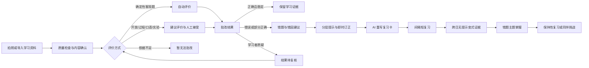

# Rhea 小学生 AI 学习助手产品需求方案 V1

| 项目 | 内容 |
| --- | --- |
| 文档状态 | 决策完成，可进入产品、设计与研发拆解 |
| 版本 | V1.0 |
| 日期 | 2026-09-08 |
| 产品阶段 | 邀请制家庭试用，不等同于公开上线 |
| 决策地图 | [规划 Rhea 小学生 AI 学习助手产品需求方案 V1](https://github.com/shinelincx/rhea/issues/1) |
| 参考产品 | [分析 Gizmo App 功能特点](codex://threads/01a05750-47dc-73f0-82c9-6750e3cf97cc) |

> 本文定义产品需求、可信边界与验收口径，不包含技术架构、模型或供应商选型、研发估时和公开首发地区的法律意见。

## 1. 产品结论

Rhea 是面向小学阶段学习者的移动优先 AI 学习助手。它把语文、数学、英语、科学的学习资料、课后练习和考试作答，转化为一条可追溯的学习闭环：

**拍照或导入 → 确认内容 → 可信批改 → 分步讲解 → 错题归集 → AI 重写复习卡 → 间隔复习 → 同伴挑战 → 掌握验证。**

产品不以“做了多少题、用了多久、赢了多少局”为最终目标，而以学习者能否在跨时间、无提示的变式练习中重新答对并保持掌握为核心结果。

Rhea 的两个直接价值是：

- 对学习者：每次打开都能知道“现在最值得做的一小步”，得到适龄且不羞辱的帮助，把错误变成可完成的成长任务。
- 对监护人：能够看清内容来源、AI 判断边界、真实学习进展和待处理事项，并可控制授权、数据和同伴挑战。

## 2. 参考 Gizmo 后的取舍

Rhea 借鉴 Gizmo“资料进入后快速转为主动练习”的产品结构，包括 AI 导入、主动回忆、间隔复习、模拟练习和游戏化反馈；但针对小学阶段重做可信和安全边界。

| 借鉴 | Rhea 的适龄化改造 |
| --- | --- |
| 导入资料后自动生成卡片与测验 | AI 内容必须从已确认学习依据重新生成，显示来源链，并先通过生成检查 |
| 主动回忆与间隔复习 | 用跨日、无提示学习证据判断掌握；逾期不扣分、不取消掌握 |
| AI 导师与讲解 | 明示 AI 身份，优先分层提示，允许质疑，依据不足时正确放弃 |
| XP、连续学习、挑战 | 奖励有效完成和个人进步，不以速度或胜负为核心，不设置阻断学习的爱心机制 |
| 同伴竞争 | 支持邀请码学习伙伴和只按年级的全网临时匿名匹配，不开放儿童社交发现、自由聊天或公开排行榜 |

Rhea 明确不采用：爱心耗尽后阻断讲解或练习、以答题速度驱动主要积分、公开主页与全平台排名、未验证 AI 自动判分、将陌生人匹配演变为社交关系。

## 3. 产品目标与非目标

### 3.1 V1 目标

1. 帮助学习者整理四学科的教程、练习和考试资料，并保持来源与课程归属可追溯。
2. 让家庭能够通过拍照完成多页作业或试卷的识别、确认、批改和分步讲解。
3. 自动归集有效错题，并用 AI 重新生成而非复制原题的复习卡和变式练习。
4. 用短复习、间隔调度和跨日无提示证据，推动错题主题真正掌握。
5. 通过邀请码学习伙伴与全网同年级临时匿名挑战，增加共同成长动力。
6. 为监护人提供低负担、可解释、可授权、可撤回、可导出和可删除的控制能力。
7. 建立 AI 质量、儿童安全、隐私和状态正确性的硬门槛，使系统能在不可靠时安全停止或降级。

### 3.2 非目标

- 不建设教师端、学校管理、学校采购或班级运营系统。
- 不建设公开内容市场、广告、订阅或支付系统。
- 不提供自由聊天、儿童搜索与关注、公开个人主页、全平台排行榜或付费竞技优势。
- 不承诺 AI 替代教师、监护人、心理咨询师或儿童安全专业人员。
- 不在 V1 宣称提升考试成绩或已经证明教育因果效果。
- 不在本方案内确定生产技术架构、模型供应商、OCR 供应商、性能指标、研发排期或公开首发司法辖区。

## 4. 用户、角色与权限

| 角色 | 核心任务 | 权限边界 |
| --- | --- | --- |
| 学习者 | 学习、拍照、确认简单识别内容、作答、订正、复习、发起或参加挑战、提出批改质疑 | 无需手机号或邮箱；不能接受自己的开放题建议评价，不能修改监护人设置的匹配年级，不能进入监护人敏感数据 |
| 监护人 | 创建家庭空间和学习档案、设置分项授权、确认学习依据、接受普通家庭练习的建议评价、查看报告、导出或删除数据 | 管理权不能改写历史作答或学习事实，不能绕过儿童安全和质量规则 |
| 管理监护人 | 建立家庭空间并邀请其他经验证监护人 | 不是“超级管理员”；高影响权限转移需按服务地区规则重新验证 |
| 专业复核人员 | 处理高影响评价、依据冲突、重复争议、系统质量或儿童安全事件 | 只在授权和职责范围内访问最小必要数据，操作需留痕 |
| 平台支持人员 | 处理监护人主动发起的支持请求 | 仅通过限定范围、限定时长、可见留痕的支持访问进入数据 |

教师在 V1 中不是产品角色，但教师答案、正式评分量规和正式考试结果可以作为高优先级学习依据。

## 5. 产品原则

1. **学习优先**：游戏化服务于学习行动，不以失败、连续打卡中断或付费限制学习。
2. **依据优先**：AI 必须围绕当前学习依据工作，不把自身生成内容循环当作事实来源。
3. **人工优先**：有效人工决定覆盖 AI 建议；所有变更保留版本和历史。
4. **证据优先**：一次答对、即时重做、使用完整提示或挑战胜利，都不等同于掌握。
5. **状态分离**：内容识别、批改判断与学习进展是三条独立状态轴。
6. **最小数据**：只收集完成学习与安全所需的数据，不用于儿童画像、广告、营销、出售或模型训练。
7. **适龄与不伤害**：反馈针对可观察的作答和下一步，不评价智力、性格、情绪、身份或“粗心程度”。
8. **可退出、可恢复**：学习者可退出挑战，监护人可撤回授权；AI 异常时保留原始记录和手动学习能力。

## 6. 移动端信息架构

V1 采用已验证的方案 A“今日路线”。首页首先回答“现在该做哪一步”，而不是展示完整功能目录。

### 6.1 一级导航

| 导航 | 主要内容 |
| --- | --- |
| 今日 | 当前最小行动、内容待确认、拍照学习、今日短复习、可参加挑战 |
| 复习 | 待订正、逾期和今日到期的复习队列；每次最多 5 张卡 |
| 错题 | 按学科、课程路径、学习单元、知识点和错题主题查看订正与掌握状态 |
| 挑战 | 学习伙伴邀请码、已有学习伙伴、全网同年级匿名匹配、挑战历史 |
| 我的 | 学习档案、个人成长、装扮、设置；监护人模式作为次级入口 |

### 6.2 首页排序

1. 阻塞后续学习的内容待确认或结果待复核提示。
2. 继续最近一次拍照学习或开始新的拍照学习。
3. 一次约 5 分钟、最多 5 张卡的短复习。
4. 当前错题订正或变式练习。
5. 已授权且符合条件时的同伴挑战。

今日路线是可调整的短行动序列，不是强制日程。跳过、逾期或没有完成不会扣除等级、XP 或连续学习记录。

### 6.3 监护人模式

- 从“我的”进入，不占据学习者首页主路径。
- 查看详细学习报告、原始资料、授权、导出、删除和支持访问前重新验证。
- 共享设备上不同学习档案必须隔离；学习者入口支持独立 PIN 或等效保护。

## 7. 端到端学习闭环

### 7.1 三条状态轴

| 状态轴 | 典型状态 | 对下游的作用 |
| --- | --- | --- |
| 内容轴 | 照片质量检查、内容待确认、题组与页序已确认、待归类 | 未确认时禁止批改、正式复习卡和挑战使用 |
| 批改轴 | 自动评价、建议评价、结果待复核、批改结果、暂无法批改 | 只有有效批改结果才能创建错题或正式学习证据 |
| 学习轴 | 待订正、待巩固、复习到期、已掌握、错题主题重开、已归档 | 由学习证据推进，不能由时间、活动次数或 AI 主观判断直接改变 |

学习提交还有三个整体状态：

- **处理完成**：其中每道题已有批改结果，或明确标为暂无法批改。
- **学习完成**：不再存在待确认、待订正或待继续事项。
- **已归档**：主动移出当前队列；不代表处理完成、学习完成或已掌握。

### 7.2 上游变更规则

当照片、页序、题组结构、题目、作答、当前学习依据或评分量规发生变化时，依赖旧版本的批改结果、错因、讲解、错题状态、复习卡、变式练习和学习证据立即成为失效内容。系统保留历史，但不得继续用于当前展示、统计、复习、掌握或挑战，并回到相应确认节点重新处理。

## 8. 内容与记录模型

### 8.1 学习组织层级

**学习档案 → 学科 → 课程路径 → 学习单元**

- 学科固定支持语文、数学、英语、科学。
- 课程路径可按教材、学期或家庭自定义安排；同一学习者可并行使用多条路径。
- 知识点是可被多条课程路径、学习单元、资料和题目引用的能力单元，不等同于章节或标签。
- 跨学科内容指定一个主学科，其他学科仅作为关联学科。
- 年级、地区、学期和教材版本通常可选；参加全网同年级匹配时，年级必须由监护人设置。

### 8.2 必须分开的四类内容

| 类型 | 定义 | 能否作为事实依据 |
| --- | --- | --- |
| 学习资料 | 拍摄、上传或导入的原始内容 | 未确认前不能 |
| 学习依据 | 被认可的原题、教材、教师答案或监护人确认内容 | 可以 |
| AI 学习内容 | AI 生成的讲解、变式练习、复习卡或小测 | 不能自动成为新的学习依据 |
| 学习证据 | 学习者作答、订正、复习或变式中的可追溯表现 | 用于学习进展，不用于定义知识事实 |

### 8.3 必须独立保存的记录

- 学习活动：课程学习、课后练习、考试或自主练习的情境。
- 学习提交：一次处理的一组照片或资料，可含多页、多题。
- 题组：公共题干、文章、图片或实验材料及其多道题目。
- 题目：独立评价的最小问题单元。
- 作答：学习者针对一道题的一次回答；同题允许多次作答，历史不可覆盖。
- 批改结果：已确认并接受的评价记录。
- 巩固任务：订正、复习卡与变式练习等后续行动。

## 9. 功能需求

### FR-01 家庭空间、建档与授权

1. 监护人可创建私有家庭空间，并为一个或多个学习者建立相互隔离的学习档案。
2. 学习者不需要手机号或邮箱；监护关系、监护恢复和高影响权限变更必须可验证、可追溯。
3. 采用分项授权：核心学习、照片与文件、AI 处理、同伴挑战、通知和未来研究用途分别管理；未来研究入口在 V1 不启用，儿童数据模型训练不在允许范围内。
4. 非核心用途默认关闭；所有授权可随时撤回，撤回后立即阻止新的相关处理。
5. 开启同伴挑战时，监护人进行一次挑战授权并设置年级；授权有效期间不再逐个邀请码或逐场挑战审批。
6. 学习者和监护人看到符合各自任务的界面；敏感设置和数据操作必须重新验证监护人身份。

### FR-02 教程与学习资料整理

1. 支持通过拍照和常见文件导入四学科的教材片段、课堂笔记、教程、练习与试卷；MVP 至少覆盖图片与 PDF。
2. AI 可建议学科、课程路径、学习单元、主要知识点、资料类型和学习活动类型，学习者或监护人可修正。
3. 识别不充分的内容进入待归类，不得凭猜测进入正式统计或挑战。
4. 同一资料可以关联多个知识点，但必须明确主学科和主要知识点。
5. 系统按来源、版本、上传时间和确认人保存可追溯关系，不静默覆盖原始资料或人工修正。
6. 对已确认资料，AI 可生成适龄教程摘要、要点回忆、示例、练习和小测；它们均属于 AI 学习内容。

### FR-03 拍照上传与内容确认

1. 支持连续拍摄或上传多页课后练习和试卷，并允许调整页序、删除重复页和补拍缺页。
2. 进入识别前检查模糊、缺角、强反光、重复页和明显不可读区域；需要重拍时阻止批改并说明原因。
3. OCR 后必须确认页序、公共题干、题目边界、题目与作答分组；不能用一个总置信度掩盖局部不确定。
4. 不确定片段逐处标记。学习者可修正简单字词或算式；复杂结构、学习依据和高影响内容转交监护人。
5. 内容待确认时，系统明确说明阻塞原因和下一步，不生成批改、错题、正式复习卡或挑战题。
6. 完成内容确认后，整页原图默认进入删除流程；仅保留完成学习所需的最小裁剪、结构化内容和来源关系。监护人明确选择“保存为学习资料”时例外。

### FR-04 批改、质疑与分步讲解

1. 只有题目、作答、当前学习依据均确认且结果确定的客观题，才允许自动评价。
2. 开放表达、过程题、口语和实验相关作答只形成建议评价；被有权成年人接受后才成为批改结果。
3. 缺少答案、规则、评分量规或可验证依据时进入结果待复核或暂无法批改，禁止猜测性给分。
4. 混合评价题按子题和评价维度分别保留状态；必要开放部分未决时，整题不得显示为已完成最终批改。
5. 每个批改结果提供适龄的“我觉得批改不对”入口。提出批改质疑后，相关结果、错题、统计与学习进展暂停使用。
6. 分层提示依次为：定位关键信息 → 提示下一步方法 → 完整分步讲解。完整讲解始终可用，不被爱心、XP、付费或惩罚锁定。
7. 讲解区分原题与当前学习依据、AI 推导步骤和补充说明，并展示 AI 内容状态和来源链入口。
8. 考试活动进行期间不显示提示或答案；提交或考试结束后才开放批改与讲解。

### FR-05 四学科建议评价与年龄适配

1. 年龄适配分为低段（一至二年级）、中段（三至四年级）和高段（五至六年级）；年级未知时采用更低层级表达。
2. 可及性适配允许口述、朗读或替代输入，但不得降低相同学习目标。
3. V1 接受书写/照片、单段短录音，以及科学观察所需的照片加书面或口头说明；不支持多人录音、实时对话、长视频或从照片断言实验确实发生。
4. 教学反馈使用“做得好的可见证据 + 一个待改进维度 + 下一步行动”，只有来源评分量规明确要求时才使用数值分数。
5. 学习者可以确认内容和提出质疑，但不能接受自己的开放作答建议评价。
6. 监护人可接受普通家庭练习的维度评价；教师正式分数或正式量规优先。高影响、来源冲突、合理答案缺失、重复质疑或安全敏感内容进入专业复核。

| 学科与任务 | V1 建议评价维度 | 禁止推断或采用的标准 |
| --- | --- | --- |
| 语文阅读 | 任务理解、文本证据、推理/概括、表达清晰 | 价值观、人格、情绪、创造力排名 |
| 语文写作 | 任务完成、内容、结构、语言 | 字迹美丑、人格和思想定性 |
| 数学过程题 | 策略、关键步骤、一致性、解释、单位/表示 | 只认一种解法、由书写风格推断能力 |
| 英语写作 | 任务与意思、词汇语法、组织 | 母语者风格、身份或自信程度 |
| 英语口语 | 可理解度、目标词句、流利度 | 母语口音相似度、口音优劣 |
| 科学 | 观察、证据、变量/条件、推理、结论、安全 | 将照片当作实验完成证明、从结论推断品格 |

维度证据状态统一使用“已表现、部分表现、尚未表现、证据不足”，只描述当前作答。

### FR-06 AI 导师与 AI 学习内容

1. AI 导师明确说明自己是 AI 学习助手，不扮演朋友、心理咨询师、监护人或真人老师，不要求保密或建立情感依赖。
2. 默认先通过问题和分层提示帮助学习者回忆和思考，再按需要给完整讲解。
3. AI 可基于当前学习依据生成教程摘要、例题、变式练习、复习卡和 5 题以内的复习验收小测。
4. 每个生成题包包含题干及必要材料、知识归属、答案或适用评分量规、讲解、难度变化、来源引用和检查结果。
5. AI 学习内容必须显示“可直接学习、建议确认、暂不可用”之一，不向学习者展示误导性的正确概率。
6. 使用当前学习依据之外的通用知识时必须标为补充说明，不得改变当前学习依据。
7. 上传内容只被当作学习资料，不能通过其中的指令覆盖产品规则、系统提示、安全规则或数据权限。
8. 生成失败可在限定次数内重新生成；仍不能通过检查时进入暂不可用，不向学习者展示猜测结果。

### FR-07 错题库、错因与掌握

1. 只有已接受的错误或部分正确批改结果自动创建错题。
2. 回答正确但使用强提示、猜测明显或自报不熟悉时创建巩固任务，不制造“假错题”。
3. 相同原题或同类错误可聚合为错题主题，但各学习提交、题目、作答、批改结果和版本历史分别保留。
4. 主学科或主要知识点未确认时进入待归类错题，可订正，但不进入正式复习卡、掌握统计或挑战。
5. AI 只提出错因建议。学习者可确认、改选“不确定”或跳过，监护人可修正；错因只描述知识、步骤、理解、阅读或表达表现。
6. 错题主题按待订正 → 待巩固 → 已掌握演进。即时订正正确只进入待巩固。
7. 错题主题掌握必须同时满足：
   - 已完成即时订正；
   - 至少两条独立成功证据；
   - 两条证据来自不同学习会话或日期，间隔不少于 24 小时；
   - 至少一条来自通过生成检查的 AI 变式练习；
   - 最后一条完全无提示；
   - 不存在未解决的相反证据或依据争议。
8. 有限提示和同伴挑战只能形成辅助学习证据；同题即时重做不能形成独立学习证据。
9. 已掌握后出现新的有效错误证据时重开错题主题，历史掌握状态不被删除。
10. 错题主题掌握不自动继承为知识点掌握；知识点证据不足时保持“尚未评估”或“学习中”。

### FR-08 AI 重写复习卡与间隔复习

1. 每张复习卡必须从当前学习依据、错题表现和主要知识点重新生成，不能直接复制原题或原选项排列。
2. 数学更换数量或情境；语文采用要点回忆、语境辨析或“结论 + 文本证据”；英语覆盖词义、词形、句型和语境；科学使用预测、因果解释和证据判断的新情境。
3. 卡片展示主学科、错题主题、AI 重新生成标识、AI 内容状态和复习到期情况。
4. “查看原题与依据”默认收起，展开后显示原表现、当前学习依据、重新生成改变点和成功标准；正确答案只在最后一级提示中展示。
5. V1 每次短复习约 5 分钟、最多 5 张卡，并有明确结束点，不诱导无限刷题。
6. 复习队列顺序为：待订正 → 已逾期 → 今日到期；同级按到期时间排序。超出本次上限的卡片自动顺延且不受惩罚。
7. V1 默认复习间隔为 `1 → 3 → 7 → 14 → 30 天`。首次独立复习不早于即时订正后 24 小时。
8. 无提示独立成功扩大间隔；定位提示后成功属于辅助证据；使用方法提示或完整讲解后只表示完成订正，下一次优先安排次日无提示变式。
9. 错误或部分正确先回到待订正；完成即时订正后从次日独立复习重新开始。
10. 逾期只提高队列优先级，不扣奖励、不降低或取消掌握；完成后从实际完成日计算下一间隔。
11. “太简单、正合适、有点难”只调整下一张卡的迁移变化或支架，不改变批改结果、证据资格、间隔和掌握状态。
12. 单卡反馈说明本次结果、提示影响、证据资格、当前状态和下一步；会话反馈说明完成数、剩余行动和最近状态变化，不突出正确率或速度排名。

### FR-09 同伴挑战

1. 挑战授权有效且年级已由监护人设置时，学习者可选择邀请码学习伙伴或全网同年级匹配。
2. 学习伙伴邀请是短时一次性邀请码。双方挑战授权有效时，接收方使用后直接建立持续学习伙伴关系，无需逐次监护人批准。
3. 全网同年级匹配只使用监护人设置的年级；不使用地区、学校、位置、能力、成绩、历史表现或其他画像。
4. 随机对手只形成一场临时挑战配对，只显示系统昵称、系统头像和本场进度；不能搜索、关注、加好友、指定重赛、查看主页或自由聊天。
5. 双方获得同学科、同年级、同难度但题面不同的独立生成题包；不得共享原错题、原图、笔迹或个人作答。
6. V1 挑战计分题只包括能够自动评价的客观题。开放题和建议评价不得进入即时竞技结算。
7. 挑战默认异步完成；速度不计分。实时呈现若中断，应无损回到异步状态。
8. 成长分由正确质量 60%、个人进步 30%、完成参与 10%构成；无个人基线时是无排名热身局。XP 不与胜负绑定，同题包只计一次并设置每日奖励上限，但不限制继续学习。
9. 结果只展示成长领先、个人突破和双方亮点，不显示连败、永久胜负榜或羞辱性“失败”反馈。
10. 允许预设鼓励与共同目标，不开放自由文本、语音、图片或链接消息。
11. 学习者或任一监护人可立即退出或解除关系；未完成挑战取消且无惩罚。
12. 随机挑战完成、退出、到期或授权撤回后立即解除配对并去标识，只保留学习者自己的挑战结果。
13. 举报立即结束挑战、隐藏对方并永久避配。严重或重复风险进入限流或冻结、监护人通知候选和人工优先复核；是否通知监护人仍受儿童安全规则约束。
14. 挑战结果只能作为辅助学习证据，不能单独建立掌握状态。

### FR-10 游戏化与学习反馈

1. 可以使用 XP、等级、徽章、连续学习、小组目标和虚拟装扮。
2. 奖励优先来自有效完成、正确表现、个人突破和共同目标，不以速度、胜负或题量作为唯一依据。
3. 不设置爱心耗尽、失败封锁、逾期扣分、连败惩罚或付费竞争优势。
4. 奖励上限只限制奖励获取，不限制学习、订正、复习或完整讲解。
5. 学习者看到自己的状态和下一步，不看到全网同龄人排名；监护人只查看家庭空间内数据。

### FR-11 学习报告与监护操作

1. 报告围绕“已取得的学习证据、待处理事项和下一步”，不以在线时长、题量或排名代替学习成效。
2. 报告可按学科、课程路径、学习单元、知识点和错题主题查看趋势，并区分错题主题掌握与知识点掌握。
3. 未决评价只显示数量和原因，不计入正确率、错题、掌握或学科趋势。
4. 监护人可查看当前学习依据、原题、评价方式、提示使用、版本、质疑和状态历史。
5. 不生成智力、性格、情绪、服从度、未来成绩或风险画像，不提供隐藏监控和逐分钟在线行为报告。
6. 通知只在分项授权后发送；锁屏通知使用不暴露学科表现、错题、挑战对象或安全内容的通用文案。
7. 监护人可导出和删除学习档案及其可关联资料、结构化作答、AI 内容、错题、报告和伙伴关系。

### FR-12 儿童安全、隐私与支持访问

1. 产品只处理完成当前学习所需的最小儿童数据，默认不将儿童数据用于广告、营销、出售、跨产品画像或模型训练。
2. 安全升级记录与普通学习、报告、挑战和指标数据隔离，不参与推荐、掌握、排名或训练。
3. 对真实伤害、危险意图或儿童保护问题，自动化只负责停止普通对话、提供适龄即时安全提示和经服务地区验证的求助入口。
4. 风险诊断、监护人通知、执法或法定机构报告、长期留存必须由受训人工结合服务地区规则决定；监护人可能涉害时禁止自动通知。
5. 在没有服务地区属地包、受训人员和实际值守能力时，对应高风险处置功能保持关闭，产品不得宣称全天实时监控或紧急救援。
6. 支持访问只能由监护人主动发起，限定数据范围和时间，并向监护人保留可见记录；到期自动结束。
7. 学习档案删除覆盖原始照片与裁剪、结构化题目和作答、AI 内容、错题、报告和伙伴关联；安全记录的保留或删除按服务地区规则独立处理。

## 10. AI 内容可信规则

### 10.1 风险和内容状态

AI 内容风险按错误影响分为低、中、高：

- 低风险：低影响的表达改写、非计分鼓励、已验证内容的简单格式化。
- 中风险：教程摘要、提示、讲解、普通复习卡。
- 高风险：批改与建议评价、生成题包答案、掌握状态变化、挑战计分与儿童安全相关输出。

风险越高，对当前学习依据、生成检查、人工复核和发布质量门槛的要求越严格。面向学习者只显示“可直接学习、建议确认、暂不可用”，不暴露内部风险分或模型置信度。

### 10.2 生成检查

所有进入学习闭环的 AI 学习内容至少检查：

1. 学习依据覆盖是否充分。
2. 题干、答案、评分量规和讲解是否一致。
3. 题目是否可解、条件是否完整、答案是否唯一或合理答案是否覆盖。
4. 是否处于当前学科、年级和课程范围。
5. 语言、认知负荷和反馈是否适龄。
6. 是否泄露答案、诱导作弊或包含不安全内容。
7. 是否错误使用旧版本、失效内容或 AI 自身输出作为根依据。

### 10.3 版本与来源链

- AI 内容的每个版本记录生成目的、所用模型/规则版本、上一个内容版本及最终学习依据版本。
- 当前学习依据变化时，所有依赖旧版本的内容立即失效。
- 不向学习者展示模型内部思维过程；来源链只解释可验证的依据和内容变化。
- 人工更正和评价接受始终保留接受者、时间、量规版本、题目版本与作答版本。

## 11. AI 质量评测与发布治理

### 11.1 独立质量卡

以下能力分别评测，不能用一个总体平均分相互补偿：

1. 图片和文字识别。
2. 页序、题组、题目与作答结构。
3. 自动评价和建议评价。
4. 分层提示与教学内容。
5. 复习卡、变式题和小测生成题包。
6. 内容阻止、人工接受、上游失效、掌握重开等状态转换。

每项建立质量卡，包含专用指标、学科/年龄/风险/输入/依据评测切片、当前结果和未解决质量错误。

### 11.2 错误等级与硬门槛

质量错误分为轻微、重要、严重、关键。未解决的关键或严重错误阻止发布，不得由总体平均分、进度压力或验收例外覆盖。受保护的安全、隐私、错误放行、数据隔离和状态失效场景必须全部通过。

### 11.3 评测和签署

- 使用受保护回归集、轮换场景、对抗/安全集和人工裁定集。
- 按语文、数学、英语、科学，低/中/高年龄适配层级，输入质量和 AI 内容风险分别报告。
- 真实儿童内容只有在明确授权、严格去标识和期限删除下才能成为质量复核样本，且与训练数据隔离。
- AI 评审器只用于低风险筛查、格式检查、候选问题发现和人工队列排序，不能独立批准高风险内容。
- 至少由质量负责人和相应学科或产品域评审者共同签署；高风险变更还需要儿童安全或合规角色，实现者不能单独批准自己的变更。

### 11.4 分阶段开放与异常处置

开放顺序为：离线评测 → 影子运行 → 小规模邀请家庭 → 扩大邀请家庭 → 全部符合条件家庭。每阶段按有效样本和质量门槛决定是否推进，不只按时间推进。

发现严重质量信号时：

1. 定位受影响能力版本、评测切片和结果范围。
2. 进入质量遏制，阻止新的不可靠输出与下游状态变化。
3. 优先安全降级；必要时回退到最近已签署版本。
4. 保留原始资料、人工确认和不依赖该能力的手动学习功能。
5. 使受影响历史结果失效或重开，不静默覆盖。
6. 修复后补充回归案例、重跑相关评测、重新签署并从影子运行恢复。

## 12. MVP 范围

### 12.1 Must：家庭试用必须具备

- 家庭空间、学习档案、共享设备隔离、监护人重新验证和分项授权。
- 语文、数学、英语、科学的图片/PDF 资料导入、归类、来源与版本管理。
- 多页拍照质量检查、OCR、页序与题组确认、题目/作答拆分和人工修正。
- 客观题自动评价；开放、过程、口语和科学观察的建议评价与人工接受。
- 批改质疑、结果待复核、暂无法批改和完整上游失效回退。
- 分层提示、完整讲解和 5 题以内的复习验收小测。
- 错题自动归集、错因建议、错题主题、待订正/待巩固/已掌握生命周期。
- 四学科 AI 重写复习卡、来源链、生成检查、最多 5 张的短复习和 `1/3/7/14/30` 天间隔。
- 邀请码学习伙伴、只按年级的全网临时匿名匹配、客观题挑战、举报结束与永久避配。
- XP、等级、徽章、连续学习和非惩罚性反馈的基础能力。
- 监护人学习报告、授权撤回、数据导出、学习档案删除和限时支持访问。
- AI 质量卡、发布硬门槛、安全降级、质量回退和儿童安全最小处置。

### 12.2 Should：不阻塞首轮闭环验证

- 图片/PDF 之外的更多资料格式和更完整的音频、视频导入。
- 完整计时模拟考试、长篇综合练习和跨学习单元组卷。
- 学习伙伴共同目标、更多虚拟装扮和更丰富的预设鼓励。
- 知识点掌握的跨错题主题综合模型。
- 更完整的可及性、语音交互、离线能力和多尺寸设备体验。

### 12.3 Won't：V1 不做

- 教师端、班级管理、学校采购与教务集成。
- 自由聊天、搜索/关注儿童、公开主页、全平台排行榜、公开内容社区。
- 开放题竞技计分、速度主导排名、失败阻断、爱心耗尽、付费竞技优势。
- 广告、订阅、支付、儿童数据营销或模型训练。
- 长视频实验判定、多人语音、实时 AI 口语陪聊，以及从影像声称真实实验已完成。
- 未完成安全与合规属地包的公开注册和地区上线。

## 13. 核心验收场景

| 场景 | 通过条件 |
| --- | --- |
| 多页数学作业 | 学习者能重拍问题页、确认页序与题组；确认前无批改；客观题批改后可分层查看步骤，错误自动进入错题库 |
| 语文开放题 | AI 只给基于适用评分量规的维度建议和教学反馈；学习者不能自批通过；接受前不进入错题或报告正确率 |
| 批改质疑 | 学习者提出质疑后结果立即待复核，相关错题、统计和掌握暂停；监护人或专业复核后留下版本历史 |
| 学习依据修正 | 替换教师答案或修正题目后，旧批改、讲解、卡片和证据全部失效，系统从正确节点重新处理 |
| 错题掌握 | 即时订正不会直接掌握；两次跨日独立成功、至少一次已检查 AI 变式且最后一次无提示后才进入已掌握 |
| 复习短会话 | 一次最多 5 张卡，有明确结束点；使用提示后能解释证据降权；逾期和顺延不产生惩罚 |
| 邀请码挑战 | 双方挑战授权有效时使用邀请码直接成为学习伙伴；只交换挑战所需最小数据，不共享原题、图片或作答 |
| 全网随机挑战 | 只按监护人年级匹配，使用系统身份；结束后去标识；举报立即结束并永久避配；无自由聊天和指定重赛 |
| 撤回与删除 | 撤回授权立即阻止新处理；删除覆盖可关联学习、AI 和伙伴数据；安全记录按属地规则独立处理 |
| AI 异常 | 不能可靠识别、批改或生成时明确进入待确认、待复核或暂不可用，原始资料和手动能力仍可用 |

## 14. 成效指标与验收门槛

### 14.1 北极星指标

**二十八日错题主题掌握达成率**

- 统计单位：一个错题主题的一次掌握周期。
- 分母：拥有完整 28 天观察窗口的有效掌握周期。未回来、未订正或主动归档仍计入分母；上游修正后无效、依法删除或不可评价的周期排除。
- 分子：在 28 天内达到 FR-07 所定义错题主题掌握标准的周期。
- 目标：点估计不低于 60%，95% 置信区间下限不低于 50%。

### 14.2 学习成效与公平门槛

| 指标 | V1 目标 |
| --- | --- |
| 三十日掌握后无提示保持率 | 点估计 ≥ 70%，95% 置信区间下限 ≥ 60% |
| 有效复习机会覆盖率 | ≥ 90% |
| 到期后 48 小时内完成复习率 | ≥ 60% |
| 无提示变式正确率 | ≥ 70% |
| 关键学科/年龄/输入方式切片 | 有充分样本的切片不得比总体低超过 15 个百分点 |

活跃天数、在线时长、题量、XP、连续学习和挑战次数只用于交互诊断，不能单独证明学习成效。

### 14.3 模块验收门槛

| 模块 | 门槛 |
| --- | --- |
| 拍照批改 | 受保护状态转换 100% 通过；人工可读提交中 ≥90% 可由家庭自行完成结构/作答确认；已确认客观题中 ≥95% 在同一会话得到有效结果或明确安全回退 |
| 复习 | ≥95% 合格错题主题生成有效可追溯卡片或明确暂不可用；开始的最多 5 张短复习中 ≥80% 到达清晰结束点；提示、证据、间隔、失效受保护场景 100% 通过 |
| 同伴挑战 | 所有安全规则通过；有效授权邀请码关系建立成功率 ≥95%；有可用对手时，随机匹配 ≥90% 在 60 秒内完成；举报、结束、永久避配受保护场景 100% 通过 |
| 监护能力 | 重新验证、授权、撤回、导出、删除、隔离、支持访问受保护场景 100% 通过；≥90% 监护人无需平台代办即可完成关键任务；误解“AI 建议是最终结论”或“到期等于失去掌握”的比例 <5%；必要监护操作中位数 ≤10 分钟/周 |
| 儿童安全与隐私 | 无未解决关键或严重错误；所有受保护/对抗关键场景阻断成功；撤回、删除、举报、支持访问到期和档案隔离全部通过；缺少属地包、受训人员或值守时相关功能保持关闭 |

没有可用随机对手必须与技术匹配失败分别统计。

### 14.4 三个不同结论

1. **家庭试用准入**：安全、隐私、AI 质量和关键状态硬门槛满足，真实家庭已完成最小试用协议。
2. **MVP 可用**：家庭无需平台代办可完成核心任务，各模块达到体验门槛。
3. **MVP 学习成功**：成熟主题队列达到预登记学习成效目标，关键护栏未恶化，必要评测切片没有证据不足。

约 6 周邀请制试用只能给出早期流程和初步学习信号；约 12 周才可观察保持。两者都不是教育因果效果证明，因果结论需另行开展有适当对照、统计功效和教育/伦理审查的效果研究。

### 14.5 指标治理

- 家庭试用前建立指标登记表，记录目的、事件来源、分子、分母、窗口、纳入排除、切片、负责人和护栏。
- 学习成效指标来自版本化学习成效事件，不以页面点击替代；核心事件完整率不低于 99%。
- 同时保留实际发生时间和系统记录时间，观察窗口结束后设 7 天迟到事件宽限期。
- 指标定义变化创建新版本，并至少与旧版本并行计算一个完整观察窗口，不静默回填或改口径。
- 关键安全、隐私、状态和严重质量门槛不允许验收例外；某个必要切片失败或证据不足时不能用总体平均值掩盖，只能限制试用范围。

## 15. 数据和权限最小化

| 数据 | 默认用途 | 默认边界 |
| --- | --- | --- |
| 监护关系与授权 | 建档、权限和合规证明 | 经验证监护人可见；高影响变更留痕 |
| 学习档案 | 年龄适配、课程组织、挑战分池 | 年级仅在挑战时用于分池；不用于能力或广告画像 |
| 原始照片/录音 | 识别题目与作答 | 整页图在内容确认后默认删除；不进入训练数据 |
| 结构化题目与作答 | 批改、讲解、错题和复习 | 家庭空间隔离；版本化；可导出和删除 |
| AI 内容与来源链 | 教学、复习和可信解释 | 不作为根学习依据；上游变化后失效 |
| 学习成效事件 | 掌握和产品成效计算 | 使用最小伪名事件，不保存原图、完整开放作答或广告标识 |
| 挑战数据 | 配对、计分、举报与自身历史 | 随机配对结束后去标识；不暴露原学习内容 |
| 安全升级记录 | 必要的儿童安全处置 | 与学习和挑战隔离；访问和留存由属地规则控制 |

## 16. 合规交付边界

V1 首先作为邀请制家庭试用，以地区中立核心验证学习闭环。真实儿童参与前必须明确服务地区，并完成最小试用协议，包括监护人同意、隐私说明、实际数据清单、删除方式和功能限制。

公开注册或地区上线前，每个服务地区都必须完成并专业审核安全与合规属地包，覆盖儿童同意、学习者同意、数据治理、安全升级、求助资源、人工处置、审计和事件演练。不能把一个地区的决定推广为“全球合规”。

## 17. 需求依赖与后续拆解建议

产品、设计和研发可按以下依赖顺序继续拆解，但本方案不指定项目排期：

1. **可信基础**：家庭空间、权限、学习依据、版本、三状态轴、失效与审计。
2. **采集与评价**：资料导入、多页拍照、内容确认、客观评价、建议评价和质疑。
3. **教学闭环**：分层提示、即时订正、错题主题、复习卡和间隔调度。
4. **成长闭环**：掌握证据、学习报告、个人游戏化与复习验收小测。
5. **同伴闭环**：挑战授权、学习伙伴、随机匹配、计分、退出、举报和去标识。
6. **上线治理**：质量卡、评测集、签署、分阶段开放、监控、降级、回退和属地包。

后续产品决策仍需单独明确：完整无障碍方案、持续语音交互、离线能力、多尺寸设备适配、公开首发服务地区，以及教师/学校场景是否进入后续版本。

## 18. 主要风险与产品应对

| 风险 | 产品应对 |
| --- | --- |
| OCR 把题目或作答认错 | 质量门、逐处不确定标记、人工确认、三状态轴和上游失效 |
| AI 给出错误答案或看似确定的讲解 | 当前学习依据、生成检查、内容状态、质疑、正确放弃、质量卡与回退 |
| AI 复习卡只是记住原题 | 强制重新生成、展示改变点、至少一条变式证据、原题默认收起 |
| 开放题评价伤害或标签化学习者 | 建议评价、维度证据、适龄反馈、人工接受、禁止人格和能力推断 |
| 游戏化驱动刷量、速度和焦虑 | XP 不绑定胜负、速度不计分、逾期不惩罚、短会话有结束点 |
| 全网陌生人匹配演变为社交 | 仅年级分池、临时系统身份、无自由聊天/搜索/主页/重赛、赛后去标识 |
| 举报或安全提示被误当成实时救援 | 自动化最小响应，属地与受训人工前关闭高风险动作，不做 24/7 救援宣称 |
| 监护人负担过重 | 首页以学习者行动为主、监护待办聚合、关键任务自助率和每周中位操作时长设门槛 |
| 总体指标掩盖弱势切片 | 预登记学科/年龄/输入切片，硬门槛独立判断，证据不足限制试用范围 |

## 19. 决策与原型追溯

### 19.1 产品决策

- [确定端到端学习闭环与核心状态](https://github.com/shinelincx/rhea/issues/2)
- [确定学习资料与四学科内容模型](https://github.com/shinelincx/rhea/issues/3)
- [确定 AI 学习内容的生成、引用与审核规则](https://github.com/shinelincx/rhea/issues/4)
- [确定监护人授权、报告与儿童隐私边界](https://github.com/shinelincx/rhea/issues/5)
- [验证拍照批改与分步讲解的可信交互](https://github.com/shinelincx/rhea/issues/6)
- [确定错题归集、错因与掌握生命周期](https://github.com/shinelincx/rhea/issues/7)
- [验证复习卡与间隔复习体验](https://github.com/shinelincx/rhea/issues/8)
- [验证安全同伴挑战的游戏化循环](https://github.com/shinelincx/rhea/issues/9)
- [整合移动端 MVP 信息架构与核心流程](https://github.com/shinelincx/rhea/issues/10)
- [定义产品成效指标与 MVP 验收门槛](https://github.com/shinelincx/rhea/issues/11)
- [确定四学科开放题评价与年龄适配基线](https://github.com/shinelincx/rhea/issues/12)
- [调研儿童安全求助的升级与监护人通知基线](https://github.com/shinelincx/rhea/issues/13)
- [确定 V1 首发司法辖区与合规交付边界](https://github.com/shinelincx/rhea/issues/14)
- [确定 AI 质量评测、人工复核与异常监控基线](https://github.com/shinelincx/rhea/issues/15)

### 19.2 已验证低保真原型

- [拍照批改与分步讲解可信流程](https://github.com/shinelincx/rhea/blob/prototype/photo-grading-trust-flow/docs/prototypes/photo-grading-trust-flow.prototype.html)
- [复习卡与间隔复习逻辑](https://github.com/shinelincx/rhea/blob/codex/prototype-review-cards-spacing-flow/docs/prototypes/review-cards-spacing-flow.prototype.html)
- [全网同年级匿名挑战逻辑](https://github.com/shinelincx/rhea/blob/codex/prototype-safe-peer-challenge-loop/docs/prototypes/safe-peer-challenge-loop.prototype.html)
- [移动端 MVP 信息架构方案 A“今日路线”](https://github.com/shinelincx/rhea/blob/codex/prototype-mobile-mvp-ia/docs/prototypes/mobile-mvp-ia.prototype.html?variant=A)

以上原型用于验证状态、交互和结构，不代表最终视觉设计。
